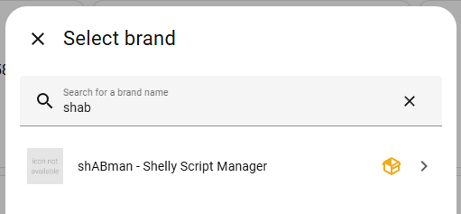
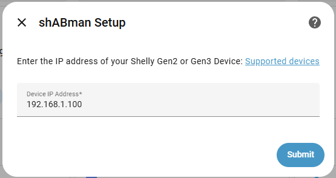
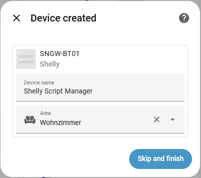
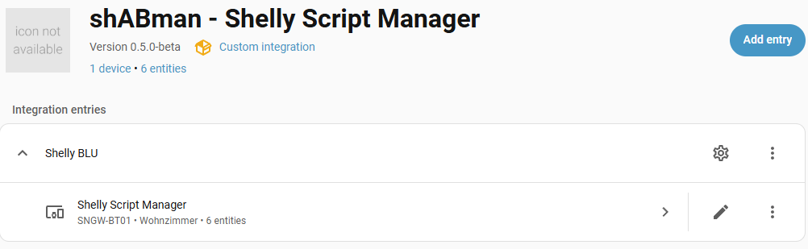
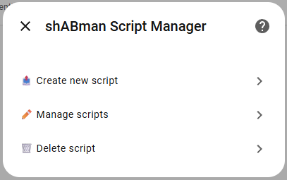
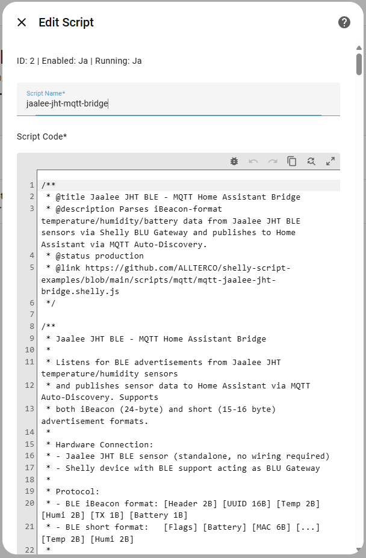
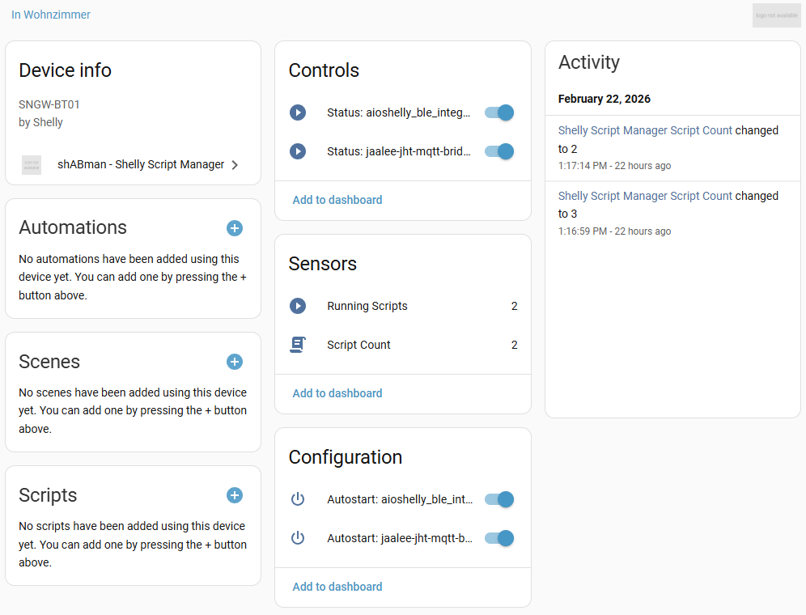

🇬🇧 **English** | [🇩🇪 Deutsch](README.de.md)

## Shelly Script Manager for Home Assistant

[](https://www.home-assistant.io/)
[](https://hacs.xyz)
[](https://github.com/arboeh/shABman/releases/latest)
[](https://codecov.io/gh/arboeh/shABman)
[](https://github.com/arboeh/shABman/actions)
[](https://github.com/arboeh/shABman/blob/main/LICENSE)
[](https://github.com/arboeh/shABman/graphs/commit-activity)
[](https://shelly.cloud)

> **⚠️ Beta Release** - shABman 0.5.0-beta is functional but under active development.
> Expect breaking changes before 1.0.0. Please report issues on GitHub.

**shABman** lets you manage [Shelly Gen2/Gen3](https://shelly.cloud) scripts directly
from Home Assistant - without leaving the UI.

## Features

- 📋 **List scripts** - all scripts on your device as HA entities
- ✏️ **Edit scripts** - modify name and code via the Options Flow UI
- 📤 **Create scripts** - upload new scripts with chunked transfer (up to 4 KB/chunk)
- 🗑️ **Delete scripts** - with automatic backup before deletion
- 🔄 **Rollback on failure** - if an edit upload fails, the original is restored automatically
- 💾 **Backup retention** - up to 10 backups per script in `config/shabman_backups/`
- ⚡ **Real-time updates** - WebSocket connection for instant status changes
- 🔘 **Switch entities** - start/stop scripts and toggle autostart per script
- 📊 **Sensor entities** - total script count and running script count
- 🛠️ **HA Services** - `upload_script`, `delete_script`, `list_scripts` for automations
- **🧪 Extensive Test Coverage**
  - **88% Code Coverage** via pytest + pytest-homeassistant-custom-component
  - Unit tests for **config flow, coordinator, entities, services**
  - Mocked HTTP/WebSocket responses with `aioresponses`
  - CI tests for **Python 3.11** (3.12 pending plugin fix)

## Requirements

- Home Assistant **2024.1+**
- Shelly **Gen2 or Gen3** device (Firmware 1.4.0+)
- Device must be accessible via local IP (HTTP)

## Supported Devices

**RPC Script API** (`rpc/Script.*`) available on **allen Gen2/Gen3** (Firmware 1.4.0+)

| Device                         | Model ID     | Firmware | Status     | Type      |
| ------------------------------ | ------------ | -------- | ---------- | --------- |
| ✅ **Shelly BLU Gateway**      | `SNGW-BT01`  | 1.4.0+   | **Tested** | Gateway   |
| 🟡 **Shelly Plus 1**           | `SHPLG-1`    | 1.4.0+   | Untested   | Plus      |
| 🟡 **Shelly Plus 1PM**         | `SHPLG-1PM`  | 1.4.0+   | Untested   | Plus      |
| 🟡 **Shelly Plus 1PM Mini G2** | `SHPLG-1M`   | 1.4.0+   | Untested   | Plus Mini |
| 🟡 **Shelly Plus 2PM**         | `SHPLG-2PM`  | 1.4.0+   | Untested   | Plus      |
| 🟡 **Shelly Plus Plug S**      | `SHPLG-IS`   | 1.4.0+   | Untested   | Plus      |
| 🟡 **Shelly Plus Wall Outlet** | `SHPLG-WO`   | 1.4.0+   | Untested   | Plus      |
| 🟡 **Shelly Pro 1**            | `SHPR-1`     | 1.4.0+   | Untested   | Pro       |
| 🟡 **Shelly Pro 1PM**          | `SHPR-1PM`   | 1.4.0+   | Untested   | Pro       |
| 🟡 **Shelly Pro 2**            | `SHPR-2`     | 1.4.0+   | Untested   | Pro       |
| 🟡 **Shelly Pro 2PM**          | `SHPR-2PM`   | 1.4.0+   | Untested   | Pro       |
| 🟡 **Shelly Pro 4PM**          | `SHPR-4PM`   | 1.4.0+   | Untested   | Pro       |
| 🟡 **Shelly 1 Mini Gen3**      | `SH1MG3`     | 1.6.0+   | Untested   | Gen3      |
| 🟡 **Shelly 1PM Mini Gen3**    | `SH1PMMG3`   | 1.6.0+   | Untested   | Gen3      |
| 🟡 **Shelly 2PM Mini Gen3**    | `SH2PMMG3`   | 1.6.0+   | Untested   | Gen3      |
| 🟡 **Shelly 2PM Gen3**         | `SH2PMG3`    | 1.6.0+   | Untested   | Gen3      |
| 🟡 **Shelly Dimmer Gen3**      | `SHDMG3`     | 1.6.0+   | Untested   | Gen3      |
| 🟡 **Shelly H&T Gen3**         | `SHHTG3`     | 1.6.0+   | Untested   | Gen3      |
| 🟡 **Shelly Wall Display**     | `SHWSD`      | 1.4.0+   | Untested   | Plus      |
| 🟡 **Shelly Motion 2**         | `SHBLUWG342` | 1.4.0+   | Untested   | Battery   |
| 🟡 **Shelly Button 1**         | `SHBTN1`     | 1.4.0+   | Untested   | Battery   |

> **✅ Tested**<br>
> **🟡 Untested**: RPC API available, community testing welcome<br>
> **Model ID**: `http://[IP]/rpc/Shelly.GetDeviceInfo`<br>
> \*\*[Device missing? Create Issue](https://github.com/arboeh/shABman/issues/new)

## Screenshots

### <br>

**Brand Recognition**<br>
shABman appears in device brand list

### <br>

**Setup Flow**<br>
Enter your Shelly device IP → automatic validation

### <br>

**Integration Ready**<br>
Entities automatically created

### <br>

**Device Overview**<br>
Added Shelly devices

### <br>

**Script Manager**<br>
Create, edit, delete scripts via UI

### <br>

**Script Editor**<br>
Full code editor with backup/rollback

### <br>

**Sensor Overview**<br>
Sensors for script count + running scripts

## Installation via HACS

1. Open HACS → **Integrations**
2. Click **⋮ → Custom repositories**
3. Add `https://github.com/arboeh/shABman` as type **Integration**
4. Search for **shABman** and install
5. Restart Home Assistant

## Manual Installation

1. Copy `custom_components/shabman/` to your `config/custom_components/` folder
2. Restart Home Assistant

## Setup

1. Go to **Settings → Devices & Services → Add Integration**
2. Search for **shABman**
3. Enter the local IP address of your Shelly device
4. The device is validated and added automatically

## Usage

After setup, open the integration options via **Configure** to manage scripts:

| Option               | Description                                                |
| -------------------- | ---------------------------------------------------------- |
| 📤 Create new script | Upload a new script by name and code                       |
| ✏️ Manage scripts    | Select and edit an existing script                         |
| 🗑️ Delete script     | Select and confirm deletion (backup created automatically) |

## Entities

For each script on the device, shABman creates:

| Entity                                          | Type   | Description                         |
| ----------------------------------------------- | ------ | ----------------------------------- |
| `switch.shelly_script_manager_status_<name>`    | Switch | Start / Stop script                 |
| `switch.shelly_script_manager_autostart_<name>` | Switch | Enable / Disable autostart          |
| `sensor.shelly_script_manager_script_count`     | Sensor | Total number of scripts             |
| `sensor.shelly_script_manager_running_scripts`  | Sensor | Number of currently running scripts |

## Services

### `shabman.upload_script`

```yaml
service: shabman.upload_script
data:
  device_id: "shellyplus1pm-aabbccddeeff"
  name: "my_script"
  code: "print('Hello');"
```

### `shabman.delete_script`

```yaml
service: shabman.delete_script
data:
  device_id: "shellyplus1pm-aabbccddeeff"
  script_id: 1
```

### `shabman.list_scripts`

```yaml
service: shabman.list_scripts
data:
  device_id: "shellyplus1pm-aabbccddeeff"
```

Fires a `shabman_scripts_listed` event with the script list.

## Backups

Before every edit or delete, shABman saves the script code as a JSON file:

```
config/shabman_backups/script_1_delete_20260222_121500.json
```

A maximum of **10 backups per script** are kept (oldest deleted automatically).

## Known Limitations (0.5.0-beta)

- No authentication support for password-protected Shelly devices
- `iot_class` is set to `local_polling`; WebSocket push is used in addition but not exclusively

## Planned Features (future releases)

- 🔗 **GitHub Integration**
  Load and import scripts directly from GitHub repositories
- ✅ **Script Editor**
  Advanced editor with syntax validation and syntax highlighting
- 🔐 **Authentication**
  Support for password-protected Shelly devices
- 📱 **Mobile Optimization**
  Lovelace cards for script overview and management

## Changelog

See [CHANGELOG.md](CHANGELOG.md).

## License

MIT © 2026 [arboeh](https://github.com/arboeh) - see [LICENSE](LICENSE)
